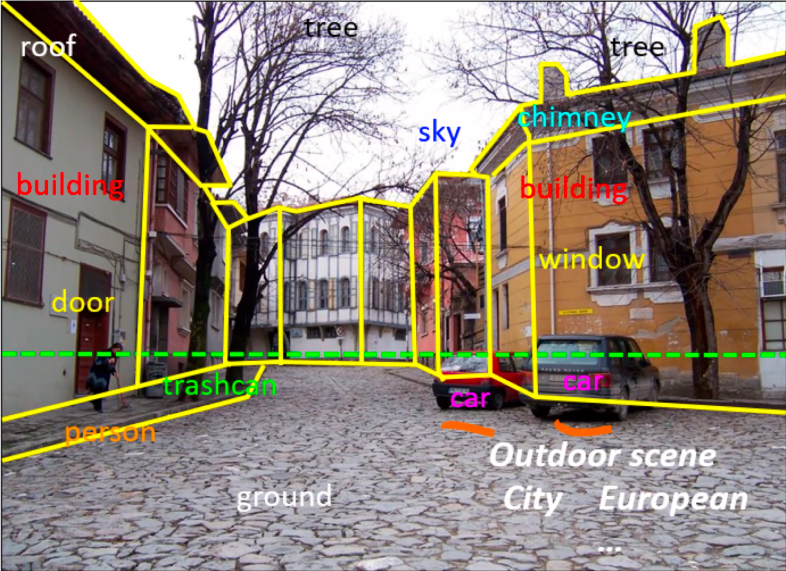

Professor: Greg Shakhnarovicha

TA: Haochena

## Constraints on human vision

Humans use "ecological regularities" (predictable structure) of the world

Ecological Regularities
: Predictable structure

## Why not copy biological vision?

This is the best system we know, but we are far from understanding it fully. Also, we still don't know the right software, or the right hardware. Visual cortex has ( 10^{11} ) neurons, largely parallel connections and it is kind of slow.

# Vision tasks and issues

## What can we extract from an image?

1. Geometric information

    

2. Semantic information

    

3. 3D Reconstruction

4. 4D Recognition

5. Pattern Recognition (for some patterns)

    1. Checks
    2. License plates
    3. Fingerprints

6. Image classification

7. Instance identification (like tracking individual wild animals)
   

8. Image parsing: instance-level detection of objects in images

9. Image generation (StyleGANv2) (is it computer vision?)

10. Face recognition (possibly solved, certainly much better than individual human's capacity of recognition)

# History of computer vision

Beginning of study of computation and vision: Hube 1959 (cat experiment)

## 1970 -1980s

## Why is vision hard?

**Variance**

## The 3 R's of vision

