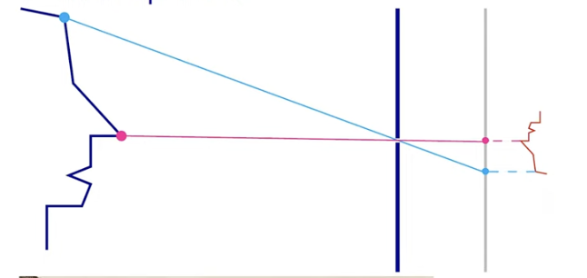
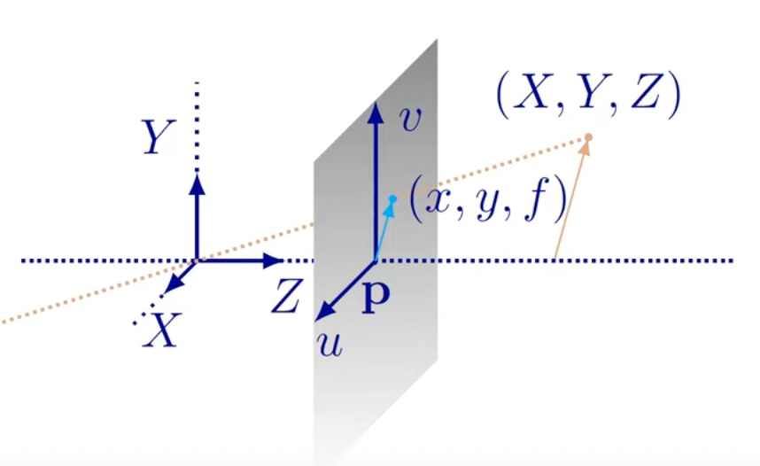
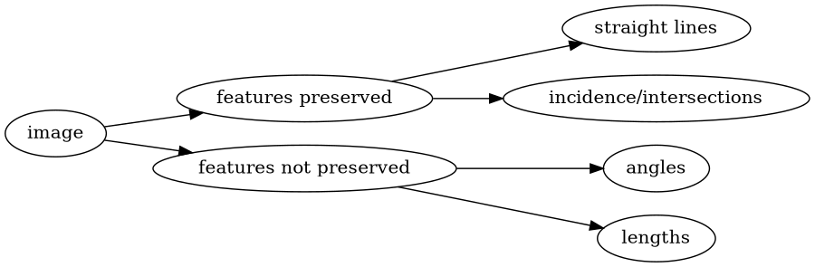
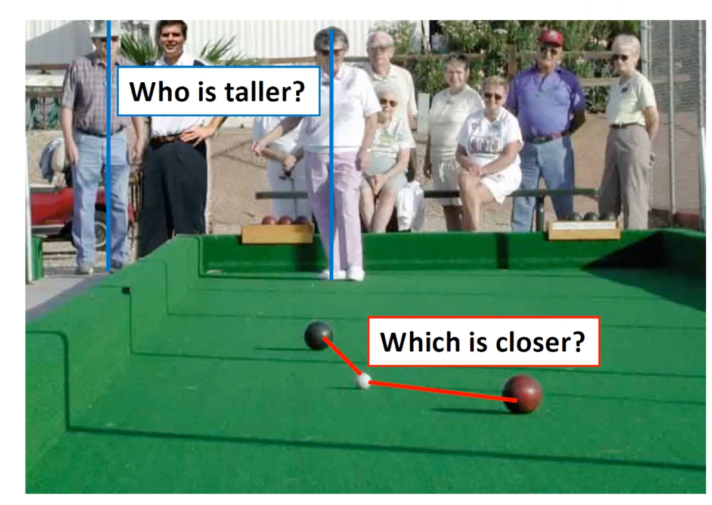

# Camera Design: Pinhole

{width=40%}

- Simplest camera: put sensor in front of object, covered so that only a small hole lets light through.

# Pinhole camera geometry

- Image plane at $Z=-f$, "virtual" projection plane at $Z=f$
- Center of projection $\textbf{p}$ at $(0,0,f)$, with $u=0, v=0$

# Perspective equations

{width=40%}

We can understand the projection plane by looking at the triangles formed by $\left( X, Y, Z \right)$ and $(x, y, f)$.

**$x$ is the scaling of the $X$ by a factor of $\frac{f}{z}$.**

(@) From similar triangles:

$$
\left( X, Y, Z \right) \mapsto \left( f \frac{X}{Z}, f \frac{Y}{Z}, f     \right)
$$

(@) Projection plane (image) coordinates:

$$
\left( X, Y, Z \right) \mapsto \left( x, y \right)
$$

where $x = f \frac{X}{Z}, y = f \frac{Y}{Z}$

> ## Notation
>
> $\left( X, Y, Z \right)$ is a point in 3D world. $\left( x, y \right)$ is a point in 2D image plane (projection).

> ## Perspective effect
>
> Same object appears larger if closer (because $Z$)is smaller

# Projections is a dimensionality reduction

{width=40%}

## Fronto-parallel plane

Fronto-parallel plane
: Projection of a plane parallel to the image plane (perpendicular to the optical axis)

**What happens to the projection of a pattern on a fronto-parallel plane?** All points are at a fixed depth $Z$, but the pattern gets scaled by $\frac{f}{Z}$ while the angles and ratios of lengths/areas are preserved.

# Vanishing points

Projections of all parallel (in 3D) lines converge to a _vanishing point_, **except those parallel to the image plane.**

Each direction in 3D _maps_ to a vanishing point in the image.

# Vanishing lines

Fact
: the set of vanishing points for all lines in a plane corresponds to a line in the image plane

{width=80%}

Horizon
: The _horizon_ is the vanishing line for the ground plane. Points higher than the camera project above the horizon. Points lower than the horizon project below the horizon.

# Perspective distortion on a sphere

Consider the occluding contour of the sphere; it lies in a plane. If the plane is not fronto-parallel, we have distortion.

# Modeling the projection

Recall we are mapping from $(X, Y, Z)$ to $(x, y)$ where $(x,y) = f \frac{X}{Z}, f \frac{Y}{Z}$. But this is a non linear transformation.

A trick to make it linear is to add one more coordinate. Then

$$
\left(  x, y \right)  \Rightarrow \underbrace{ \begin{pmatrix}
x \\
y \\
1
\end{pmatrix} }_\text{homogeneous image coordinates} \text{ and } \quad
\left( X, Y, Z \right) \Rightarrow \overbrace{\begin{pmatrix}
X \\
Y \\
Z \\
1
\end{pmatrix}}^\text{homogeneous scene coordinates}
$$

1. To homogeneous coordinates: **just add 1**
2. From homogeneous coordinates: divide by the last coordinate

   $$
   \begin{pmatrix}
   x \\
   y \\
   w
   \end{pmatrix} \Rightarrow \left( \frac{x}{w}, \frac{y}{w}  \right) \text{ and } \quad \begin{pmatrix}
   X \\
   Y \\
   Z \\
   W
   \end{pmatrix} \Rightarrow \left( \frac{X}{W}, \frac{Y}{W}, \frac{Z}{W} \right)
   $$

> Perspective projection collapses an entire ray $\mathbf{C} + \lambda \cdot \left( X, Y, Z \right)$ to a point $\left( f \frac{X}{Z}, f \frac{Y}{Z}  \right)$

Using homogeneous coordinates, projection is a linear operation.

$$
\left(\begin{array}{cccc}
f & 0 & 0 & 0 \\
0 & f & 0 & 0 \\
0 & 0 & 1 & 0
\end{array}\right) \begin{pmatrix}
X \\
Y \\
Z \\
1
\end{pmatrix} = \begin{pmatrix}
fX \\
fY \\
Z
\end{pmatrix} \Rightarrow \left( f \frac{X}{Z}, f \frac{Y}{Z} \right)
$$

I practice, need to handle different coordinate systems and the fact that pixrl coordinates are different from projection plane coordinates

# Pixel coordinates

{width=50%}

- Principal point $p = p_x, p_y$: point in the image where the optical axis crosses the projection (image) plane
- Normalized coordinate system: origin at $\mathbf{p}$
- Image coordinates: origin is **the corner**
- Want the principal point to **map to $\left( p_x, p_y \right)$ not $\left( 0,0 \right)$**

Then: $\left( X, Y, Z \right) \to \left(  f \frac{X}{Z} + p_x , f \frac{Y}{Z} + p_y \right)$

$$
\begin{aligned}
\begin{pmatrix}
X \\
Y \\
Z \\
1
\end{pmatrix} \to \begin{pmatrix}
fX + Zp_x \\
fY + Zp_y \\
Z
\end{pmatrix} &= \begin{bmatrix}
f & & p_x & 0 \\
& f & p_y & 0 \\
& & 1 & 0
\end{bmatrix} \begin{pmatrix}
X \\
Y \\
Z \\
1
\end{pmatrix} \\
&= \underbrace{\begin{bmatrix}
f & & p_x \\
& f & p_y \\
& & 1
\end{bmatrix}}_{\text{calibration mat} \ \mathbf{K}} \underbrace{\begin{bmatrix}
1 &  &  & 0 \\
 & 1 &  & 0 \\
 &  & 1 & 0
\end{bmatrix}}_{\text{projection mat} \
[\mathbf{I}  \mid \mathbf{0}]} \begin{pmatrix}
X \\
Y \\
Z \\
1
\end{pmatrix}
\end{aligned}
$$

## Pixel coordinates: units

After mapping, we have $\left( x,y \right) = \mathbf{K} [\mathbf{I} \mid 0] \left( X,Y,Z \right)$ in the image coordinates, in the **world** units.

Pixel Size
: Represented by $\frac{1}{m_x} \times \frac{1}{m_y}$ where the density of the image sensor is $\frac{ m_x }{\text{meters}}$ pixels horizontally and $\frac{ m_y }{\text{meters}}$ pixels vertically (in meters).

To convert to pixel coordinates, multiply by pixel magnification factor:

$$
\mathbf{K} = \begin{bmatrix}
m_x &  &  \\
 & m_y &  \\
 &  & 1
\end{bmatrix} \begin{bmatrix}
f &  & p_x \\
 & f & p_y \\
 &  & 1
\end{bmatrix} = \begin{bmatrix}
\alpha_x & & \beta_x \\
 & \alpha_y & \beta_y \\
 &  & 1
\end{bmatrix}
$$

> # Conclusion
>
> We know how to map a scene point $X, Y, Z$ to pixel coordinates:
> $\mathbf{K}[\mathbf{I}|\mathbf{0}]\begin{pmatrix}
X \\
Y \\
Z \\
1
\end{pmatrix}$

# Orthographic projection

Special case
: distance from $\mathbf{C}$ to image plane is infinite.

In the weak perspective model, points are first projected to the reference plane using orthogonal projection and then projected to the image plane using a projective transformation.
