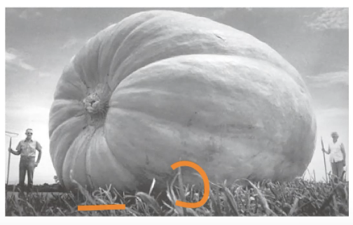
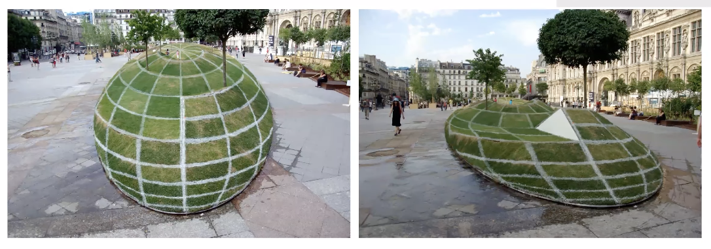
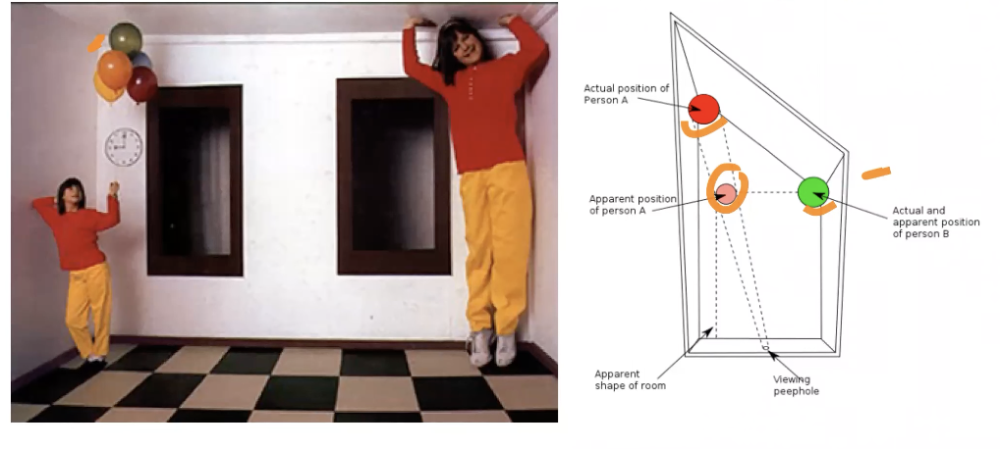
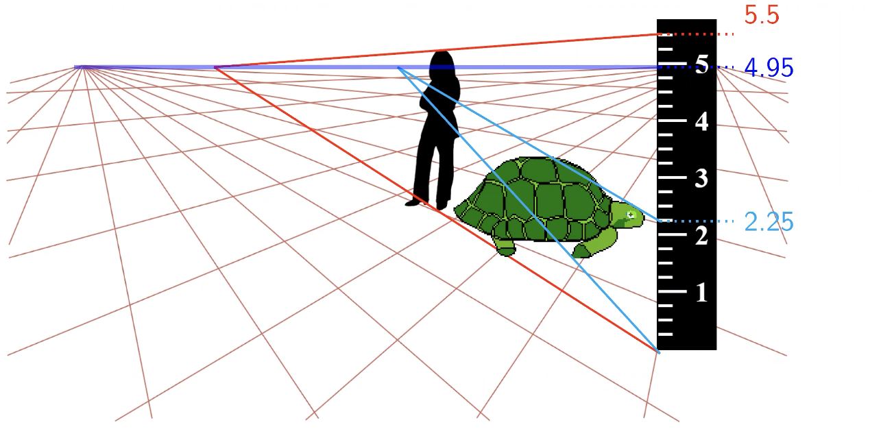
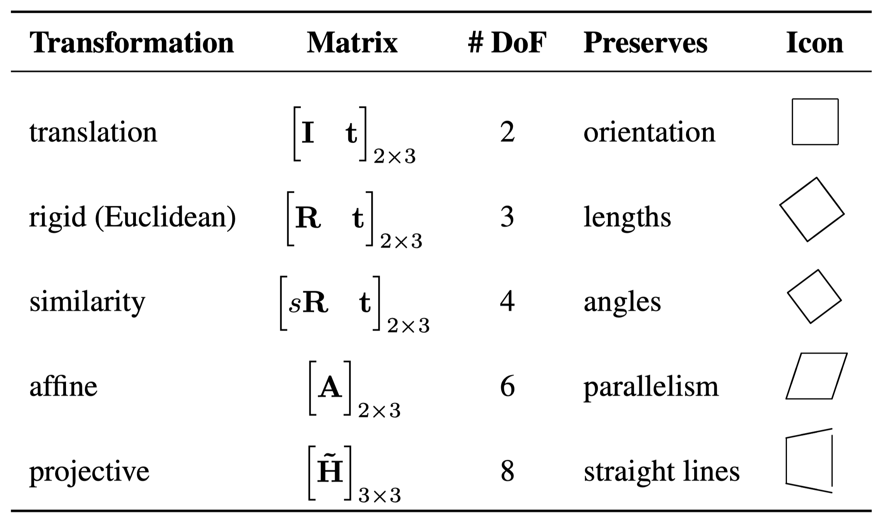
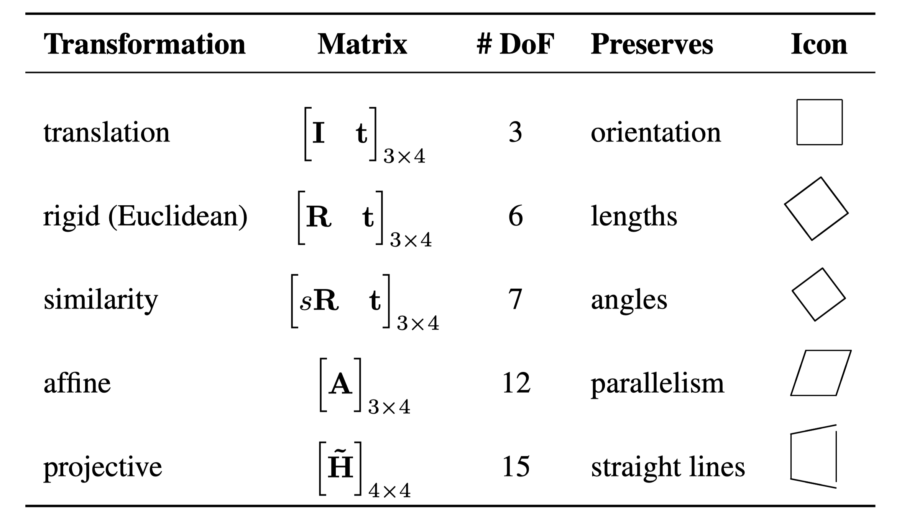

# Geometry of a single view

A major goal of computer vision is to reconstruct the 3D scenes from images.

The problem is that there's ambiguity when analyzing a scene from a single view.

Think of it this way: say you have a mapped point from the real world in the 2D image plane. Can you think of at least two different points in the real world that would map to that same point in the 2D plane? If the answer is yes, then there's ambiguity.

## Single view ambiguities

1. Size ambiguity

   

2. Foreshortening

   : Apparent change in shape of things due to a perspective projection
   

3. Anamorphic perspective

   : A distorted projection that requires the viewer to occupy a specific vantage point, use special devices, or both to recognize an image
   

4. Perspective cues can be source of illusions

   

# Measuring with a ruler

Assumptions
: Both object and reference are vertical, on the ground

The height of the camera will be the height of an object who exactly touches the horizon (4.95 in the case of the ruler)

> # Interlude
>
> ## Cross products
>
> Consider linearly independent \( \mathbf{a},\, \mathbf{b} \in \mathbb{R}^3\). Their cross product \(\mathbf{a} \times \mathbf{b}\) is orthogonal to both, so it will also be orthogonal to the plane defined by \(\left( \mathbf{a},\, \mathbf{b} \right)\)
> Then \(\mathbf{a} \times \mathbf{b} = \|a \| \|b\| \cdot \sin\left( \theta \right) \cdot \mathbf{n}\) where \(\mathbf{n}\) is a unit normal vector to the \(\left( \mathbf{a},\, \mathbf{b} \right)\) plane.
>
> {width=40%}
>
> \[
> \mathbf{a} \times \mathbf{b} = \begin{pmatrix}
> a_2b_3 - a_3b_2 \\
> a_1 b_3 - a_3 b_1 \\
> a_1 b_2 - a_2 b_1
> \end{pmatrix}
> \]
>
> ## Lines and points in projective space
>
> Homogeneous 2D points: \(\left( x, y, w \right)\) same as \(\left( \lambda x, \lambda y, \lambda w \right)\)
> We can also convert to inhomogeneous coordinates \(\left( x, y, w \right) \to \left( \frac{x}{w}, \frac{y}{w} \right)\). To convert back to homogeneous coordinates \(\left( x, y \right) \to \left( x, y, 1 \right) \to \left( \lambda x, \lambda y, \lambda \right)\).
>
> **Ideal** points: \(\left( x, y, 0 \right)\) dont have inhomogeneous counterpart. **These points are at infinity**
> Line equation: \( \mathbf{l} \cdot \mathbf{x} = 0 \)
>
> Line \( \mathbf{l} \) passing through \( p_1, p_2 \):
> \[
> \mathbf{l} \perp\left( \mathbf{p}_1 \right), \mathbf{l} \perp\left( \mathbf{p}_2 \right) \Rightarrow \mathbf{l} = \mathbf{p}_1 \times \mathbf{p}_2
> \]
>
> Intersection \( \mathbf{p} \) of two lines \( \mathbf{l}_1, \mathbf{l}_2 \):
> \[
> \mathbf{l}_1 \perp\left( \mathbf{p} \right), \mathbf{l}_2 \perp\left( \mathbf{p} \right) \Rightarrow \mathbf{l}_1 \times \mathbf{l}_2
> \]
>
> ## Representing Transformations
>
>{ width=60% }
>
>{ width=60% }

