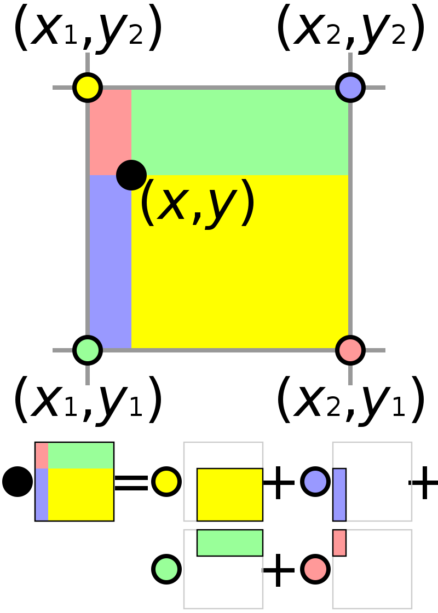

This is a test.

# Homography

Is this a test?

$$
\lambda \begin{bmatrix}
 x' \\
y' \\
1
\end{bmatrix} = \left(\begin{array}{ccc}
h_1 & h_2  & h_3   \\
h_4  & h_5 & h_6  \\
 h_7 & h_8 & 1
\end{array}\right) \cdot \begin{bmatrix}
x \\
y \\
1
\end{bmatrix}
$$

@marginfigure

# Camera rotation and translation

$$
\begin{aligned}
\tilde{\mathbf{X}}_{c}=\mathbf{R}(\tilde{\mathbf{X}}-\tilde{\mathbf{C}}) \quad\left(\begin{array}{c}
\tilde{\mathbf{X}}_{c} \\
1
\end{array}\right) &=\left[\begin{array}{cc}
\mathbf{R} & -\mathbf{R} \tilde{\mathbf{C}} \\
\mathbf{0} & 1
\end{array}\right]\left(\begin{array}{c}
\tilde{\mathbf{X}} \\
1
\end{array}\right) \\
\mathbf{X}_{c} &=\left[\begin{array}{cc}
\mathbf{R} & -\mathbf{R} \tilde{\mathbf{C}} \\
\mathbf{0} & 1
\end{array}\right] \mathbf{X} \\
\mathbf{x} &=\mathbf{K}[\mathbf{I} \mid \mathbf{0}]\left[\begin{array}{cc}
\mathbf{R} & -\mathbf{R} \tilde{\mathbf{C}} \\
\mathbf{0} & 1
\end{array}\right] \mathbf{X} \\
\mathbf{x} &=\mathbf{K}[\mathbf{R} \mid-\mathbf{R} \tilde{\mathbf{C}}] \mathbf{X}, \quad \mathbf{t}=-\mathbf{R} \tilde{\mathbf{C}} \\
\mathbf{x} &=\mathbf{K}[\mathbf{R} \mid \mathbf{t}] \mathbf{X}
\end{aligned}
$$

-   x: point in image coordinates (homogeneous)
-   $[\mathbf{I}|0]$: $3 \times 4$ projection matrix
-   K: $3 \times 3$ 2D transformation (calibration matrix)
-   $[\mathbf{R} \mid \mathbf{t}]: 3 \times 4$ camera pose (extrinsic) matrix
