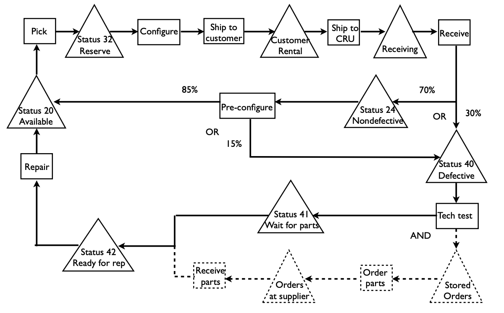
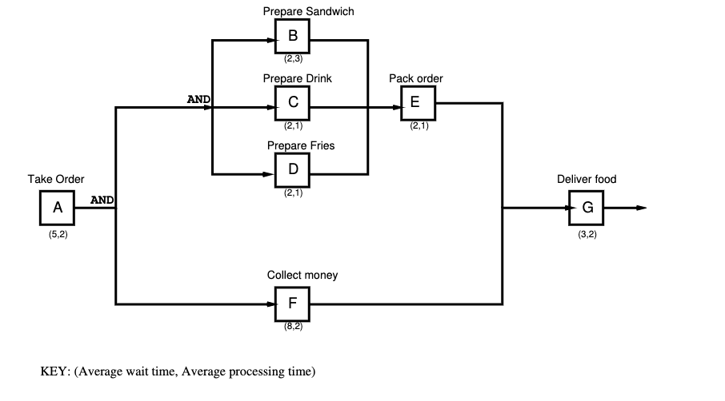

> Which operational improvements have the most impact on the bottom line?

# Example: Shouldice Hospital

Hospital in Canada specialized in treating hernias. Patients spend 4 days in residence and undergo a single hernia procedure.

Last year, they treated 6850 patients over 50 weeks. They don't do procedures on weekends, so they reach max occupancy in the residence by the middle of the week.

Patients pay $111$ per day to stay at the hospital. Patients pay an average of 525 per surgery.

-   $\text{Av. weekly revenue} = 111 \cdot 4\text{days} \cdot \frac{6850}{50\text{ patients per week}} = 60828 \text{ per week}$
-   $\text{Clinic} = 525 \text{ per client} \cdot 137 \text{ patients per week} = 71925$

$$
\textbf{Total Revenue} = \underbrace{777 \cdot \overbrace{\underbrace{\lambda}_{\text{throughput}} \cdot CT }^{\text{Inventory}} + 525 \lambda}_{\text{operational metric}}
$$

## Business models and the Ops Quad

1. Pay for participation: Revenue = $a \lambda$
    1. Movie theater, buffet restaurants, Starbucks
2. Pay for time: Revenue = $b \cdot \lambda \cdot CT = b \cdot\text{INV}$
    1. Parking meters, hotel, Ziferblat cafe (?)
3. Pay for both: Revenue = $a \cdot \lambda + b \cdot\text{ INV}$
    1. Shouldice, cabs

## Pulling operational levers at Shouldice

$$
\textbf{Total Revenue} = 777 \cdot {\lambda} \cdot CT  + 525 \lambda
$$

-   If Shouldice increases $CT$ do revenues increase?
    **NO**, if $INV$ is tightly bounded $\to$ if $CT$ increases, then by Little's Law, $\lambda$ should decrease.

-   What can be done to increase revenue?
    1. Increase the number of beds: $\uparrow INV_\text{max}$
    2. Decrease patient length of stay: $\downarrow CT \Rightarrow \ \uparrow{\lambda}$

# CRU Computer Rentals

What is the nature of CRU's business?
: Buy and maintain computers and peripherals for rent.

## Big picture process

> Utilization (as used in this case) = Inventory on rent $\div$ Total inventory owned by CRU
> **But utilization is an inadequate performance measure**

## Process Flow Diagram

**Assumption**: Ignore WIP inventory at activities

## Process Analysis

\begin{table}[H]
\resizebox{\textwidth}{!}{%
\begin{tabular}{|l|l|l|l|l|l|l|l|l|l|}
\hline
Metric & Customers & Receiving & Status 24 & Status 40 & Stored Orders & Supplier Orders & Status 41 & Status 42 & Status 20 \\ \hline
$\lambda$ & 1000 & 1000 & 700 & 405 & 405 & 405 & 405 & 405 & 1000 \\ \hline
$\text{INV}$ & 8000 & 500 & 1500 & 1000 & 500 & 405 & 905 & 500 & 2000 \\ \hline
$\text{CT}$ & 8 & 0.5 & 2.14 & 2.47 & 1.23 & 1 & 2.23 & 1.23 & 2 \\ \hline
\end{tabular}%
}
\end{table}

## 8 week vs 4 week marginal analysis

**Conclusion**: 4 weeks rental lose money (on average)

## Ideas for improvement

1. Marketing levers
    1. Target the long-term market
    2. Lower price to capture more demand in the 8 week market
2. Operation levers
    1. Eliminate misclassification
    2. Decrease repair costs

> Interventions may only affect part of the operation

# IBM Credit

## Whi is CT so large?

# Critical Path

Whereas capacity is determined by a bottleneck, cycle time is determined by a critical path.

Critical Path
: The critical path is the longest path through a process which all jobs must pass.

## Example

1. What is the critical path?
    1. AFG: 22 mins
2. What is the bottleneck resource of the system? What is the capacity?
    1. B. 1/3 orders per minute
